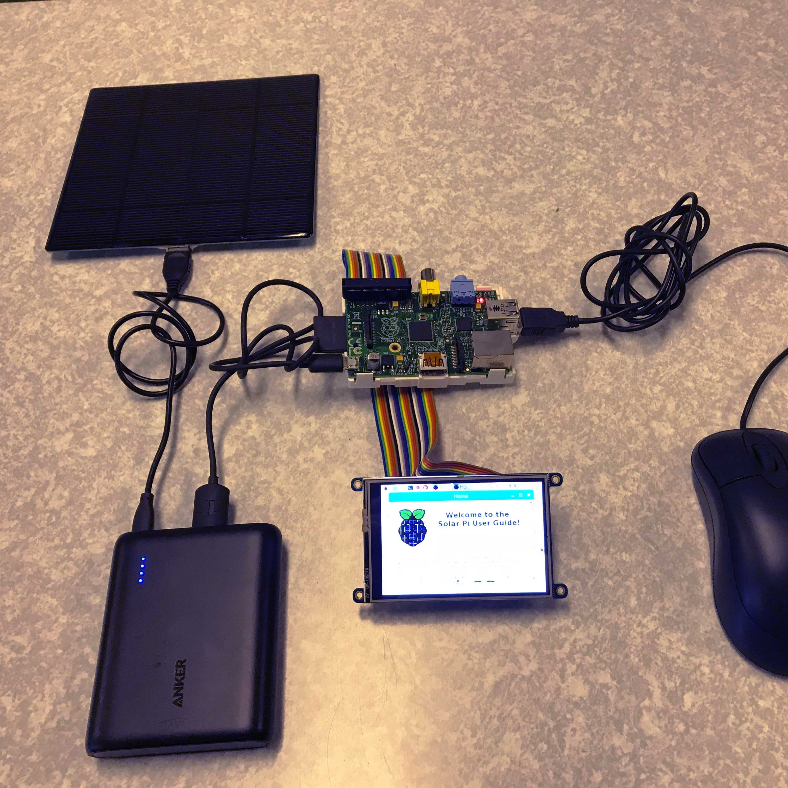
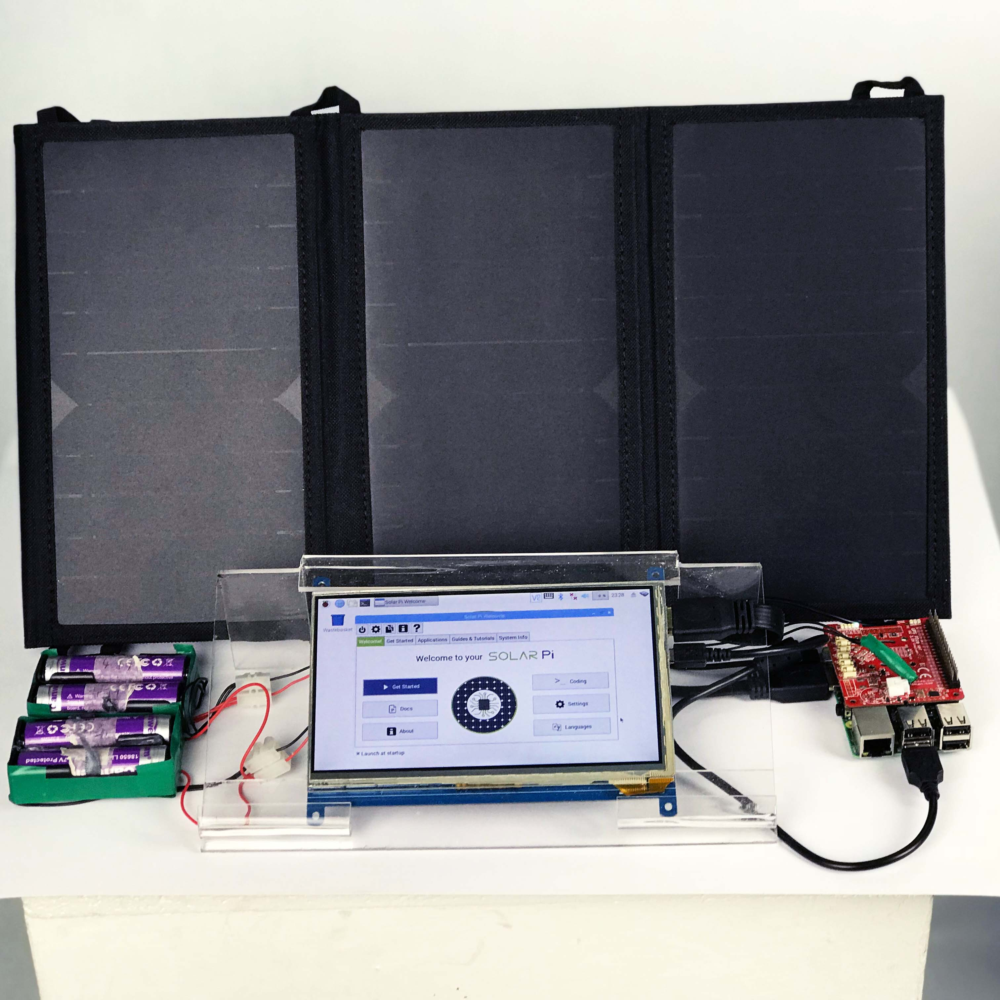
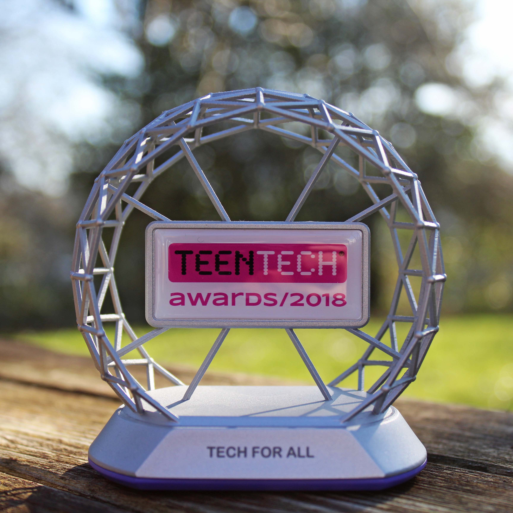
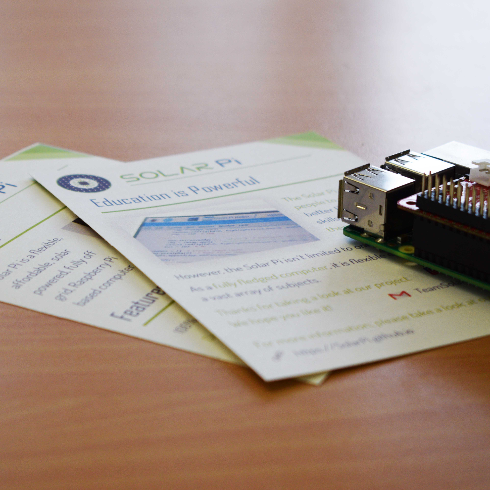

<!-- Main -->

<section id="three">
	

		<header class="major">
			<h2>Summary</h2>
		</header>
		
The Solar Pi is a device that aims to bring digital skills to developing countries, where an Internet connection and stable power isn't available. It's designed to work completely off-grid and offline, being powered by solar energy or its onboard batteries. Something that sets the Solar Pi apart from other laptops and tablets is that it is completely modular - <i>all</i> of the parts can be swapped out if they fail or need to be upgraded, reducing waste and costs. Its flexibility also means that it can be configured to the client's specifications. Want a greater battery capacity? No problem.  
		The Solar Pi we've been working with consists of the following parts: 
        • Raspberry Pi 3 Model B 
        • Pico UPS HAT 
        • 4 x 2250 mAh batteries 
        • 7" touchscreen 
        • 19 W solar panels 
        • Wireless keyboard and trackpad 
        • A custom 3D printed case 

	

</section>

<!-- One -->

<section id="one">
	

		<header class="major">
			<h2>Project Timeline</h2>
		</header>
	

</section>
<!-- Two -->

<section id="two" class="spotlights">
	<section>
		
		

			

				<header class="major">
					<h3>TeenTech Year 1: 2016-2017</h3>
				</header>
				

				This isn't the first year we've competed in TeenTech - it's our second!  
As a part of an extra-curricular activity, we found the idea of using a Raspberry Pi as a computer for developing countries and decided to develop it further for our entry into TeenTech. 
What surprised us is that we got into the finals! We brought with us an 'embryo' of today's Solar Pi, with only the core components and no case. Unfortunately, we did not win in our category, as we didn’t have a design for the final product. 
 
Our old Solar Pi also had a number of issues: 
• The touchscreen was too small 
• The single solar panel wasn't powerful enough 
• It used an older Raspberry Pi, meaning that it had poor performance 
				

			

		

	</section>
	<section>
		
		

			

				<header class="major">
					<h3>TeenTech Year 2: 2017-2018</h3>
				</header>
				

                    We started off our second year of TeenTech by contacting Lord Mendelsohn - someone who attented the TeenTech finals the year before. After writing a letter to him, he generously donated £250 to fund the new parts for the project. We decided to use a new set of parts to address the shortcomings of the last year's Solar Pi.  
                    We also began to write some software in <a href="https://www.python.org/">Python</a> for the Solar Pi. This enhanced its offline capability, gives the user an introduction into using a computer and allows settings to be changed that are specific to the Solar Pi. The code is available to view and download online at <a href="https://github.com/SolarPi/Solar-Pi">https://github.com/SolarPi/Solar-Pi</a>.  
                    Finally, we also started work on designing a case that would be 3D printed. This would be a case that would hold all the components securely, taking the Solar Pi from a selection of parts to a fully functioning device.. Screenshots of the CAD drawing and images of the parts being 3D printed can be viewed in the <a href="/3-gallery">Gallery</a>.
                

			

		

	</section>
	<section>
		
		

			

				<header class="major">
					<h3>TeenTech Year 2 Finals: June 2018</h3>
				</header>
				

				We made it to the TeenTech finals for the second year in a row! 
				In response to the judges' feedback, we decided to contact Martyn Hastings MBE from the <a href="https://dorsetexp.org.uk/">Dorset Expeditionary Society</a> to conduct further research into the importance of computing in developing countries. He replied with some extremely useful feedback, stating that <i><b>“Any… simple devices that are preloaded with course material and easily maintained… would be an excellent step forward.”</b></i>. 
				We also started to 3D print the case, but during the process, its gearbox failed! This meant that we attended the finals with half the case printed.  
				Our main category was 'Tech for All', with our secondary one being 'Manufacturing'. At the TeenTech finals in London, it was was a pleasant surprise to see other guests taking interest in our project and (inbetween the visits to our stand) seeing the creative ideas in other teams' projects. 
				Finally, after a nervewracking wait, we were presented with an award, winning the 'Tech for All' category!

				

			

		

	</section>

	<section>
		
		

			

				<header class="major">
					<h3>Buckingham Palace Awards Ceremony: February 2019</h3>
				</header>
				

				Towards the end of January we received an email regarding the Awards Ceremony, held at Buckingham Palace. At the time of writing, we haven't attended yet, but we're really looking forward to it!  
				It's a privilage to be able to go and present our work there, and it's also amazed us that our solar powered computer has taken us this far. TeenTech has provided us with a fantasic opportunity and it's been a truly fascinating journey. As a team, we've learnt more about Linux, programming, 3D printing and design - knowledge we wouldn't have gained had we not taken part.  Happy 10th birthday, TeenTech!
				

			

		

	</section>
</section>

<!-- Three -->

<section id="three">
	

		<header class="major">
			<h2>Gallery</h2>
		</header>
		
Take a look at the 'Gallery' page to see more photos!.

		<ul class="actions">
			<li><a href="3-gallery.html" class="button next">Take a look</a></li>
		</ul>
	

</section>

