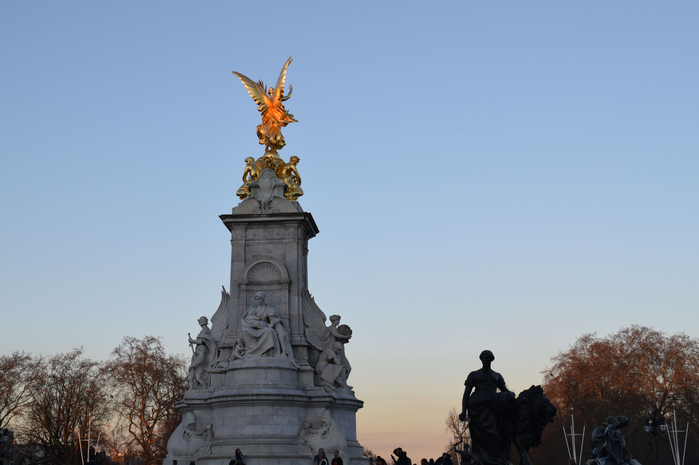

> First of all, hello! Second, some context. I'm a member of the Solar Pi team who was tasked to create this website, as well as do other computing bits for the project. This blog is purely from my point of view, so you might get something a bit different if you ask the other two team members.
> 
> Admittedly, this isn't really a _proper_ blog - apologies if you're view this on a PC where each image takes up the entire screen. I would do something about it, but I don't think it's particularly easy to do fancy image stuff with Jekyll, so there's my excuse :P
>
> Regardless, I hope you enjoy it, and if you're a TeenTech competitor, I wish you the very best of luck!

## Awards Ceremony Preparations

The Awards Ceremony was obviously the main event, but there is a bit of a story to tell behind the scenes.

Due to some _complicated_ circumstances (that was related to our school, not TeenTech) we didn't hear much from TeenTech after the Finals in Summer 2018. Towards the end of January, as a team, we decided to contact TeenTech directly. We got a reply and as it turns out, an email had been sent out a week beforehand, informing all the finalists about the Awards Ceremony. Great timing! We passed on the details to a couple of members of staff and the trip was organised.

In that email were some details about the Awards Ceremony. First off, the timings looked a bit like this:

| Timetable |      |
| --------- | ---- |
| 1500      | Arrival at Buckingham Palace |
| 1510-1530 | Time to display work |
| 1530-1630 | Presentation and ceremony |
| 1630 | Refreshments with HRH Duke of York |
| 1700 | Departure |

They also wanted to post the official Buckingham Palace invitations to the school and this too was arranged. They noted that there would be an easel that could hold an A1 piece of card for us to display our work on to. We set to work, designing an A1 display board.

As usual, we left things to the last minute, which left us in a situation that was identical to the one we found ourselves in when preparing for the Finals. The half term was fast approaching and we'd only had a day after the half term before we went go to Buckingham Palace. This meant that we had to get everything printed before we broke up - in a somewhat frantic rush, time was dedicated after school and in free lessons to ensure that we got everything done. We also made some handouts - these were updated to include our website (which you are currently looking at) and small changes to the colour scheme. I have to admit, we might have gone _slightly_ overkill on the number of handouts - we printed off around 40 but in the end, we only handed out 2 (sorry, trees).

As well as the display board and handouts, we also created this website. It was fairly hastily put together during the half term, but it seems to do the job. I encountered a few issues - one with colours and another with page names. As it turns out, finding complementing colours for dark blue and green is quite difficult. The eagle-eyed among you might have noticed the page naming scheme - we have [`1-info`](1-info), [`2-about`](2-about), [`3-blog`](), [`4-gallery`](4-gallery) and [`5-docs`](5-docs). For some reason, the order in which the pages are ordered on the homepage was by alphabetical order and there wasn't an easy way to change this. Due to the time constraints, this meant that ~~I just left it~~ I decided to just prepend a number to the page name to get things into the right order. Sorry for annoying you, web devs.

Finally, we created a holder (if you could call it that) that the Solar Pi could be attached to and the holder in turn would be bolted to a piece of foam board. The large gap in the centre of the display board was where this was supposed to go. If you take a look at the holder below, the Pi goes to the left and the gap between the two pieces of plywood was for a USB cable that goes out the back to the display. The batteries were then supposed to lie across the USB cable and plywood, but this didn't really work out in practice.

There was also a mount for the display, but I'm afraid you'll have to just imagine what it looks like, as (at the time of writing) it's currently being used in another project. The display has four mounting holes, one in each corner. There are two strips of plywood that go across the top and bottom. The display and plywood are then bolted to a piece of MDF and a pair of bolts would also go far enough to go into the foam board.

A day before we set off, we received the invitations from Buckingham Palace! Inside was a red invitation card, a map, a letter with additional information and a another invitation card with gold edges. Included with the map showed the 'Identification Requirements'. There was Box A and Box B. Students (like myself) only had to show a form of ID from Box A. What was quite amusing was that a 'Firearms Certificate' was in that category, which is something that you wouldn't expect a student to have...

## TeenTech Awards Ceremony

**Date: Tuesday 26th February 2019**

Today is the day! I have to admit, I was pretty excited about the trip to Buckingham Palace. If I told Year 7 me that I'd go and have tea and biscuits there, I'd think I'd grown up to become insane, or that I'd consumed something I wasn't really supposed to take.

<blockquote class="twitter-tweet" data-lang="en">
We’re very excited to be going to Buckingham Palace today to celebrate our TeenTech Award winners! <a href="https://twitter.com/hashtag/teentechawards?src=hash&amp;ref_src=twsrc%5Etfw">#teentechawards</a>
&mdash; TeenTech (@teentechevent) <a href="https://twitter.com/teentechevent/status/1100323317951709187?ref_src=twsrc%5Etfw">February 26, 2019</a></blockquote>

<blockquote class="twitter-tweet" data-lang="en">
We&#39;re looking forward to meeting all the 2018 TeenTech Award teams at Buckingham Palace today!
&mdash; TeenTech (@teentechevent) <a href="https://twitter.com/teentechevent/status/1100342559778443265?ref_src=twsrc%5Etfw">February 26, 2019</a></blockquote>

This was just a regular school day, so in essence, I had a day off school too, which was a shame ~~or nice added bonus~~. My first lesson was Photography - a pretty normal lesson. The teaching assistant who was going on the trip with us was there in the lesson with us, and we were discussing both the trip and various Photography ideas. The lesson ended and we decided to go to pack everything during Lesson 2, skipping Chemistry (sorry, chemistry teacher!). We picked up our stuff from DT and checked that we'd got all the things we needed - the Solar Pi, display board things, handouts, 3D printed bits and pieces, extra cables/battery banks and the trophy. Everything seemed to just about fit, so we went to another classroom until 10:30 - when we were due to leave school to walk to the train station. While we waited, we looked at _how_ we'd get to Buckingham Palace, and watched a video from the TeenTech finals last year, with a cheer whenever we saw 'Solar Pi' pop up on screen.

The time eventually came when we had to leave, so we met up with the TA who'd be going with us and headed off. Looking at Google Maps right now, it looks like it took us around 30-40 mins to get to the train station. Still, it was a pleasant walk, as the skies were clear and sunny. The day also happened to be in the middle of a 'mini heatwave', so the weather was pretty odd for February - when we reached London, it hit 18C, which is pretty toasty compared to the 'regular' temperatures for this time of year.

Once at the train station, we all split up and bought some snacks ~~also known as lunch, if you're me~~ for the train journey ahead. The train arrived on time (hurray!) and we grabbed our seats. To keep me occupied, I listened to a podcast that I downloaded some time before (probably for my previous long journey): [Episode 110 of Hello Internet](http://www.hellointernet.fm/podcast/110).

About 90 mins later, we arrived at London Euston, on time (I think) and set off towards Buckingham Palace. We had around 2 spare hours in London, so we decided to take a route that would pass the British Museum. I know that the map I've provided isn't that neat, but I'm sure you get the idea. If you're wondering why I've drawn on the map instead of just stolen what Google's given me, it's because we took a route that Google Maps hasn't suggested.

We got to the British Museum, but before we could get in, there was a bag check. I wonder what they thought about a big white cardboard box sitting inside a backpack (don't worry, it only contains the Solar Pi, and nothing else)... clearly they were okay with it as we went through without any issues. After taking some photos outside, we decided to head in. It was my first time at the British Museum, and the space inside is pretty impressive - I'm sure the photos will do the talking :)

We stayed for around 30 mins, and in that time we had a toilet break and had a quick wander around. Now, there's something which I found quite amusing, but I can't remember whether we saw it on the way in or on the way out (probably the latter). There was a woman standing by a tree, rapidly tapping her phone with a fairly hefty amount of force - a team member noted that it reminded them of how 'old people' use phones. We headed off towards Buckingham Palace, not really aware of how long and tiring it was going to be...

We passed Piccadilly Circus, down Piccadilly and through Green Park, before finally reaching Buckingham Palace. As it turns out, Green Park provides some really nice opportunities for good photos with 'leading lines':

And now for some photos of Buckingham Palace itself! But I've held some back - there are better ones further down.

<blockquote class="twitter-tweet" data-lang="en">
Not long until we welcome our young innovators to the celebration! <a href="https://twitter.com/hashtag/teentechawards?src=hash&amp;ref_src=twsrc%5Etfw">#teentechawards</a> <a href="https://t.co/FYIK6b87mq">pic.twitter.com/FYIK6b87mq</a>
&mdash; TeenTech (@teentechevent) <a href="https://twitter.com/teentechevent/status/1100391148370182145?ref_src=twsrc%5Etfw">February 26, 2019</a></blockquote>

We arrived just before 14:30, so we had some time to take photos and well, just take it all in. A horse drawn carriage came and went and we saw the Palace Guards do their march.

Now, in the image above, you'll see what looks like another entrance in the bottom left - this is where a small group of people started to gather and we moved there too, as it got closer to 14:45. The TA who came with us on the trip decided that it would be time for him to go and find something to do for the next couple of hours. You see, only one adult could come into the Palace, and that was our Computer Science teacher - the one who had organised the trip for us. When the time came, 3 or 4 armed police officers invited us in and told us to show ID and the red invitation card. Sadly, we were told that we couldn't take photos from _inside_ the palace gates, so I have a grand total of 0 photos from there. After waiting around for a bit, we were told to walk towards the entrance - the small one on the left in 'Buckingham Palace 2'. It felt a bit strange, walking out to the centre of Buckingham Palace in front of a fairly large group of people who were behind the gates. Once we were in, we could take photos again (hurray!). But we didn't have time to stop, so I couldn't take very many photos.

We were greeted by Palace staff at the door, who took our red invitation cards. It was at this point that I regretted not taking a photo of it before... Inside was an area with a high ceiling and red carpets - the sort of stuff you'd expect a palace to have, and to the right was a table with our name badges. We were instructed to leave valuables and any audio/video recording equipment in the cloakroom as we weren't allowed to bring them in with us.

We then went into the room in which the Awards Ceremony was going to be held. Chairs had been set out, with a large display showing the TeenTech logo and a stand where the speaker would, well, speak. The doors at the front of the room were open, facing the Palace gardens and letting the warm air in. Around the back and to the left (you see, the room was sort of 'L' shaped) were a series of easels that we'd put our work on to. A handful of teams opposite to us had small tables instead. Our easel was at the end of the 'L' shape, and it's here that there was another room where there were refreshments.

We were given around 10-15 mins to set up our easel, and our display was planned to be like this:

* 4 x A3 pieces of card that together would from an A1, landscape display board to go on the easel
* An A3 piece of foam board that had the Solar Pi bolted to it
* This piece of foam board would then be put in front of the card in the centre - we had left a A3 sized gap in the centre of display board to accommodate this

But our plan had a _bit_ of flaw in it. To our horror, we failed to realise that the easel was in portrait and not landscape. This meant that we only managed to fit 2 pieces of A3 onto our  board, and so our easel looked somewhat empty compared to many of the other teams, who had been smarter and printed bits off in A4. However, I think we made up for it by actually bringing our prototype along, as who doesn't like an interactive demo? We also found out that we couldn't put the foam board on the easel as it would just tip over forwards and subsequently end up on the floor - something that we really didn't want (thanks, gravity!). We tried to tilt the easel back further but it couldn't tilt back far enough. As the time for the ceremony approached, we were encouraged to wrap up the preparations. We frantically tried to assemble the Solar Pi, but left the assembly half complete as we concluded that we wouldn't have enough time.

<blockquote class="twitter-tweet" data-lang="en">
<a href="https://twitter.com/dallascampbell?ref_src=twsrc%5Etfw">@dallascampbell</a> kicking off celebrations! <a href="https://twitter.com/hashtag/teentechawards?src=hash&amp;ref_src=twsrc%5Etfw">#teentechawards</a> <a href="https://t.co/3cZHBrzNZZ">pic.twitter.com/3cZHBrzNZZ</a>
&mdash; TeenTech (@teentechevent) <a href="https://twitter.com/teentechevent/status/1100414574547820546?ref_src=twsrc%5Etfw">February 26, 2019</a></blockquote>

Dallas Campbell was the person hosting the event, as unfortunately, Maggie Philbin couldn't make it. We sat towards the front of the room and waited. It seemed that the Duke wasn't due to arrive just yet, so a random team was picked (not us) and had a 'practice' to show what we'd do when we were called up. It was pretty much along the lines of: walk up to the front, receive certificates from the Duke, stand in front of large display, have your photo taken, sit back down.

We ended up waiting around for another 15-20 mins until the Duke arrived and when he did, he was greeted with a round of applause.

The awards ceremony had now begun! 

Luckily, we were the second or third team to be called up, so we could be more relaxed for the rest of the ceremony. The awards ceremony itself only lasted for 30 mins, as the organisers wanted as much time as possible for the Duke to talk to the ~25 teams that were present.

<blockquote class="twitter-tweet" data-lang="en">
🎥Today The Duke of York, Patron of <a href="https://twitter.com/teentechevent?ref_src=twsrc%5Etfw">@teentechevent</a>, hosted the <a href="https://twitter.com/hashtag/teentechawards?src=hash&amp;ref_src=twsrc%5Etfw">#teentechawards</a> at Buckingham Palace.  The Awards challenge students to use science &amp; technology to develop ideas to make life better, simpler, safer or more fun.  Congratulations to everyone who received their Award! <a href="https://t.co/851VhdZV8z">pic.twitter.com/851VhdZV8z</a>
&mdash; The Duke of York (@TheDukeOfYork) <a href="https://twitter.com/TheDukeOfYork/status/1100465165844340738?ref_src=twsrc%5Etfw">February 26, 2019</a></blockquote>

When it had finished, we returned to our easel and a lady from Lloyds Bank came over. Lloyds Bank was the sponsor for the 'Tech for All' category, and we were judged at the finals by one of her colleagues, so it was nice to see someone from Lloyds there. She asked about the project and how the Solar Pi worked and during that time, a couple of us (myself included) continued assembling the Solar Pi. When everything was plugged in, we connected it to a portable battery bank and turned it on. Fortunately, it worked first try and one member of the team was democratically elected ~~(no, of course he wasn't forced! We would never do that...)~~ with holding the piece of foamboard that the parts were mounted on to. We also wanted to show the Solar Pi working on its own, so we carefully disconnected the battery bank in the hope that the Pi would behave and continue running. Again, the Solar Pi worked as it should and it proved to be a successful demo!

After this, we went to get some refreshments. They were on a table that was all the way at the back of the room, with the apple juice, water and biscuits at the centre and to the right was a tea dispenser, which was manned by a member of palace staff. I got some apple juice and a biscuit, both of which was very nice. The apple juice was the 'proper' stuff - when you finished, there were bits of apple left at the bottom of the glass. After this, I sort of lost track of the order things went in, so I'll put everything down here. Dallas Campbell and the Duke came over to take a look at our project - the Duke suggested that we contact a company based in Brisbane, who were working on low cost computers by reusing parts. Someone (I can't quite remember whether it was the Duke or Dallas Campbell) also mentioned that in certain places in Nigeria, they had completely skipped some stages of technological development, as they went from no or little network coverage to full 4G coverage - very impressive. A fellow finalist (who won the 'Rail' category) came over as well - his project was called 'Smartcase' (more on this later). One of the things that stood out to me was his complements towards the Solar Pi software - people hadn't really commented on it much and it was nice to get some positive feedback. We explained what the project was about and demonstrated various parts of the software. I also went to get a cup of tea - twice, in fact. The second time I grabbed another biscuit as I wanted to have the full experience of dipping the biscuit into tea. The tea was in a teacup with the EIIR emblem, which I only just learnt that it's called a [Royal Cipher](https://en.m.wikipedia.org/wiki/Royal_cypher). The teacup also had a gold coloured rim. The saucer was in a similar style as well, again with the Royal Cipher and a gold coloured rim. The teaspoon was quite special - it was noticeably heavier than regular teaspoons and so we suspected that it was made out of silver. We made several jokes about stealing the spoon and keeping it as a souvenir, but don't worry - all the spoons we used were left in the palace when we departed. The tea itself was (you guessed it) quite nice and it was served at just the right temperature too. I had both cups of tea with milk and no sugar. We also joked about how there was a good chance that actually, all the refreshments were from Waitrose. 

With my final cup of tea, myself and another team member wandered around and visited the Smartcase easel and asked about his own project. To quote one of his own handouts, "A Smartcase is an attachment to a Swegway that acts as a seat, suitcase and an office desk." It's quite an impressive feat for someone in Y7 to take on the project himself, and so we congratulated him on winning. We also visited another easel, this time, it was a team of 3 with a project aiming to help malnourished people in developing countries. When they had finished explaining, they suddenly asked: _Pointing to fellow team member_ "Which year do you think she's in?". We didn't really have an answer at that point, given the rather abrupt timing, but we later concluded that she was in Year 11. We then visited a third easel, but they had already packed up and was about to leave. It was at this point that we realised that we should pack up too, and went back to our own easel.

Our teacher and third team member had already started to pack away, and so we disassembled the Solar Pi and decided on who would take what. The refreshments area had also been closed off and the room has started to become emptier. We were just about to leave when a member of our team went over to Dallas and asked to have his photo taken with him. Eventually, we left the room and went to the cloakroom to pick up our bags and phones.

Remember when I said that there would be better photos further down? Well, here they are. The sun was setting and combined with the clear skies, this gave parts of the Palace a pink/orange tint. I took the time to take some photos and to say 'goodbye' to the Palace, as the chances of me coming back is pretty slim.

As we headed out, we thanked the police officers that were at the exit and made our way to the TA who was waiting for us outside the gates. It turned out that he went to the Lego store to buy some gifts for a friend, who's birthday was coming up soon. The sunset also gave the Victoria Memorial (the golden statue outside Buckingham Palace) a orange shine and an impressive backdrop, as I'm sure you can see.

We decided that we definitely didn't want to walk back to Euston (doing so would have probably killed my legs) and so we decided to take a taxi. We arrived at Euston with 40 mins to spare, so we went to find some food. A team member and I walked around various places, before concluding that there wasn't anything that we liked (I know, it's ridiculous). We finally settled on a Boots meal deal after the teacher found that it was quite cheap. There, I learnt that Oreo Creme Eggs were a thing and so I bought one (as well as a regular Creme Egg), along with some other snacks.

The return journey was fairly uneventful - I think we were all pretty knackered after a lot of walking. In case you're interested, I listened to [Hello Internet Episode 111](http://www.hellointernet.fm/podcast/111), which I downloaded specifically for this trip (no, this blog post is not an ad for Hello Internet, I promise). We arrived back to the same train station to be picked up by our parents.

According to my Fitbit, we walked over 11.5km and accumulated nearly 18,000 steps - given my regular levels of activity, I don't think I'll be exceeding this any time soon.

That's pretty much it! I wrote up a short bullet point list of the day's events when I got home and exactly a week after this trip, I started to write this blog post, properly. Looking back, it was definitely quite the experience. I will again reference the [About](/2-about.html) page to show how grateful I am - while not _everything_ went to plan, to see the project I'd been working on for over half my time in secondary school (we started it in Year 9) go this far is truly amazing. There's also an element of sadness with this trip too - it marks the end of the line for Solar Pi and TeenTech. While there is a chance that the project might progress further, next year I'll be too old to participate in the 'regular' TeenTech categories.

So, that's really the end of this blog post. I'm not too sure how to finish it off, so thanks for reading, and well done if you read all 4423 (or so) words!