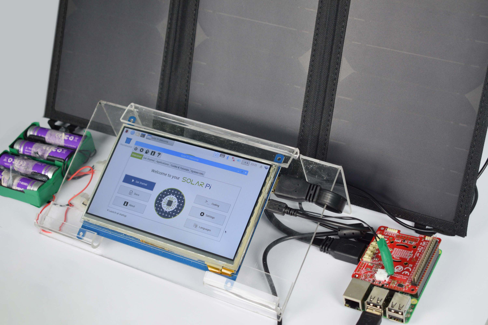
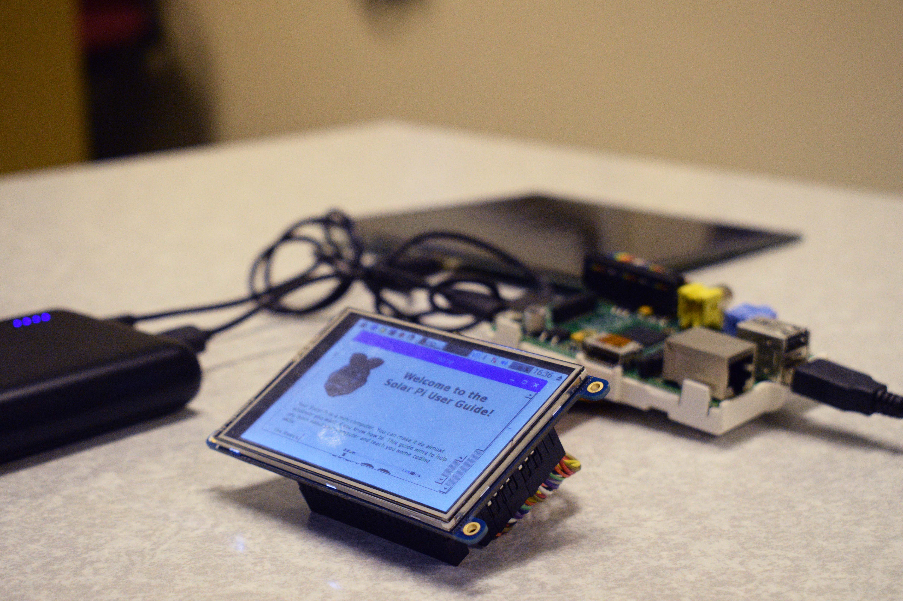
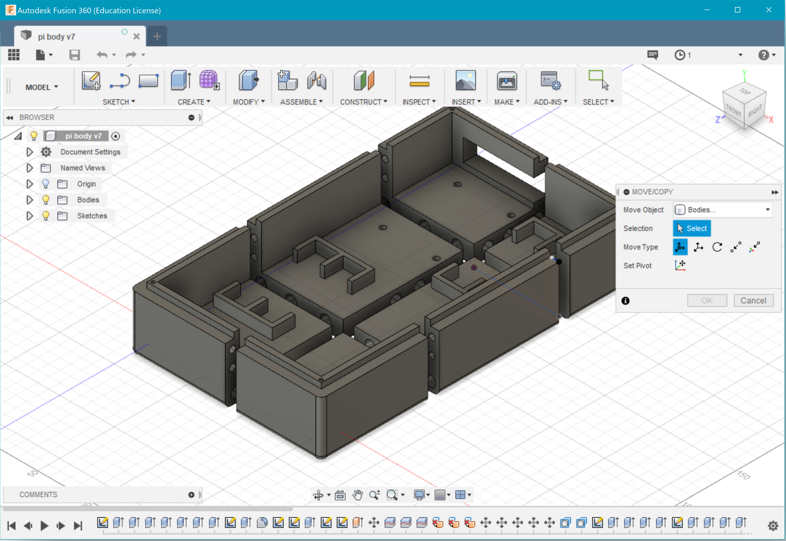
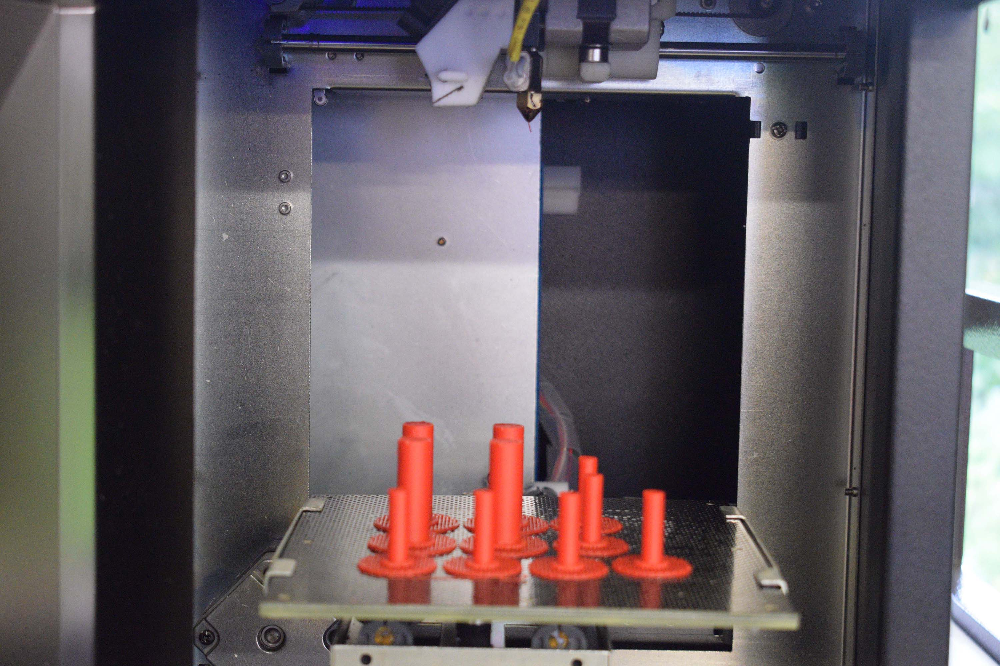
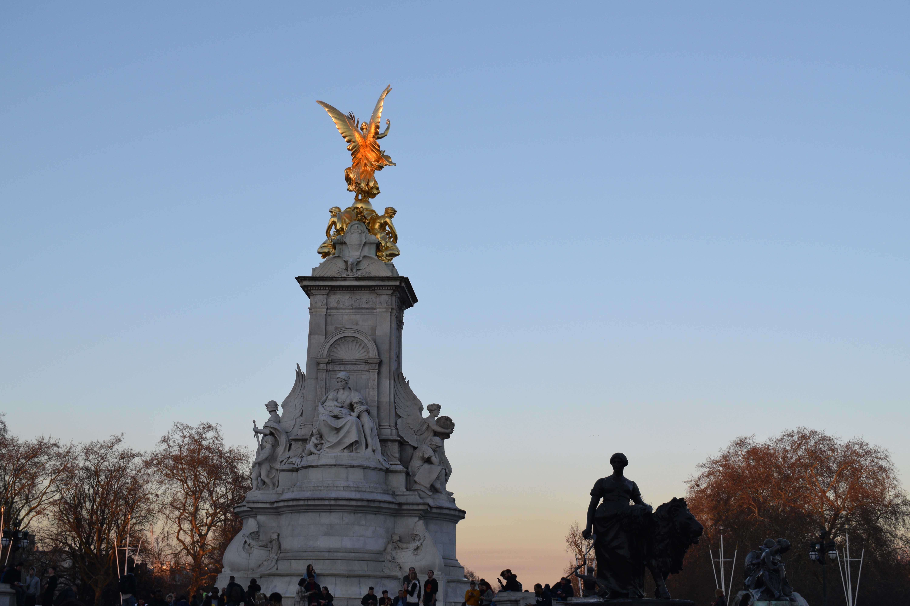
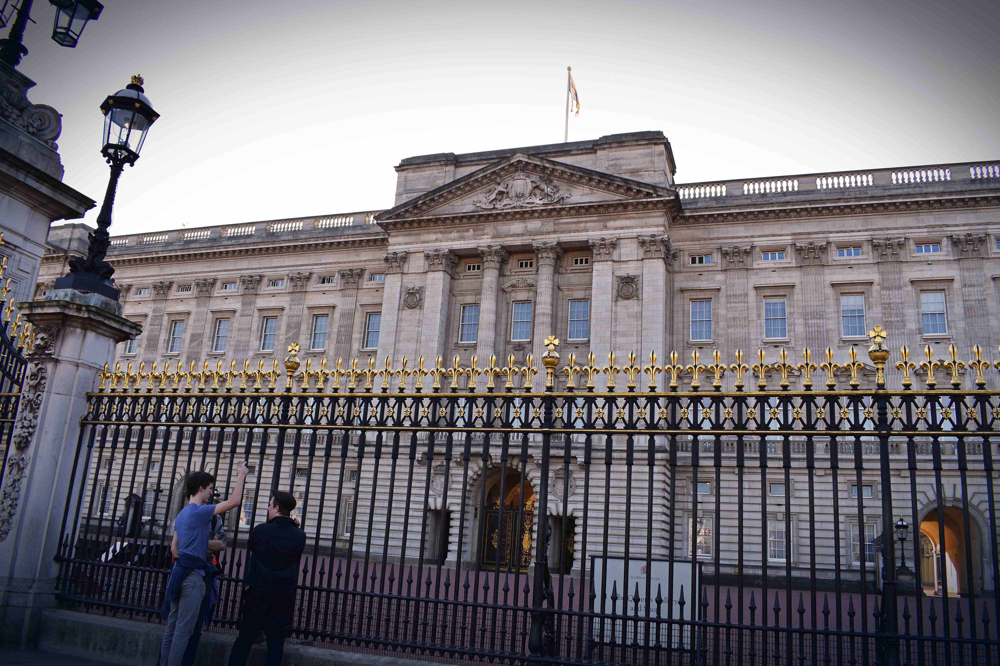
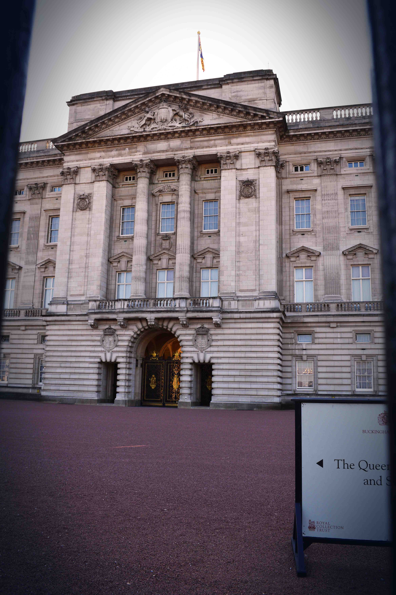
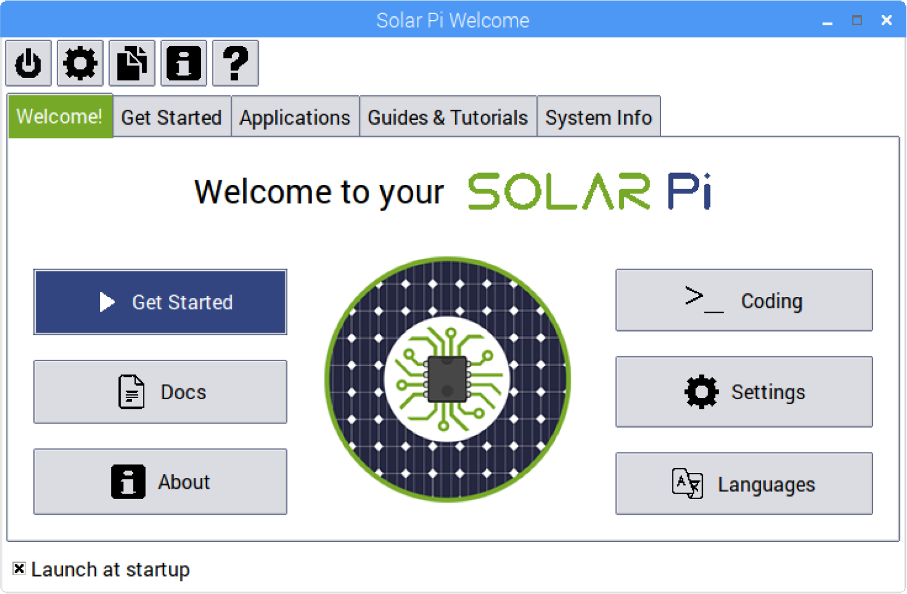
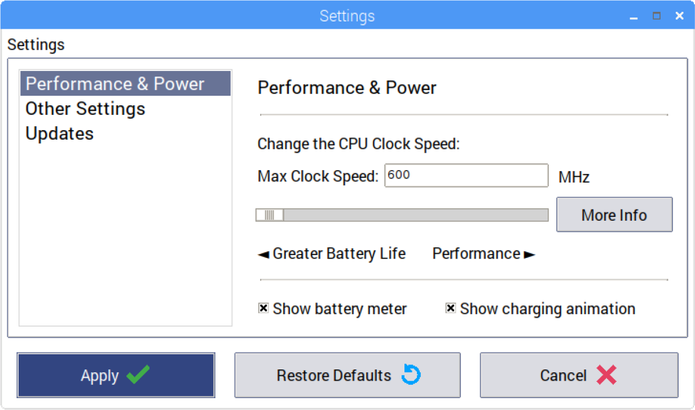

Here are some more images that would we couldn't fit into the Project Info timeline.

**Note:** You might spot compression artefacts in these images - these have been heavily compressed to ensure that they load quickly.

# The Solar Pi

## Our current Solar Pi

## Our old Solar Pi

# 3D Printing

## Fusion 360 CAD Drawing

## Our 3D Printer in action!

Though sadly, its gearbox failed before all the case could be printed. Rest in peace, *3D Big One*.

# Buckingham Palace Awards Ceremony

Here are some more photos of our trip to Buckingham Palace! Unfortunately, we weren't allowed to take any photos inside, so this is all we've got.

## Old Content

The content for the Buckingham Palace visit section on [Project Info](/1-info) used to have the content below. I've moved it here for the sake of completeness as curious readers might want to know more.

> Towards the end of January we received an email regarding the Awards Ceremony, held at Buckingham Palace. At the time of writing, we haven't attended yet, but we're really looking forward to it!
>
> It's a privilege to be able to go and present our work there, and it's also amazed us that our solar powered computer has taken us this far. TeenTech has provided us with a fantasic opportunity and it's been a truly fascinating journey. As a team, we've learnt more about Linux, programming, 3D printing and design - knowledge we wouldn't have gained had we not taken part.
>
> Happy 10th birthday, TeenTech!

# Solar Pi Software

## Welcome

## Settings

